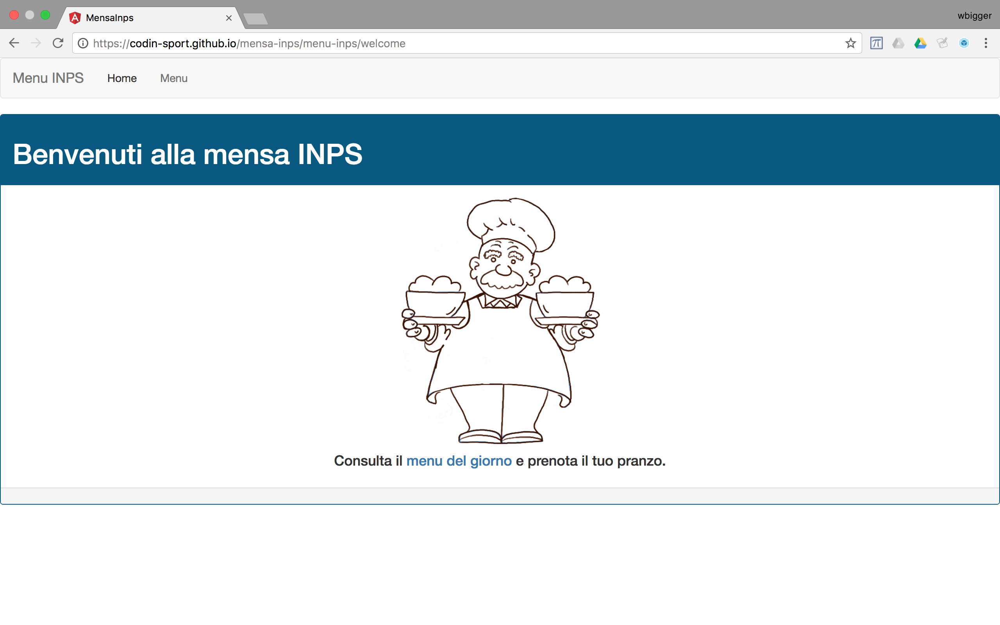
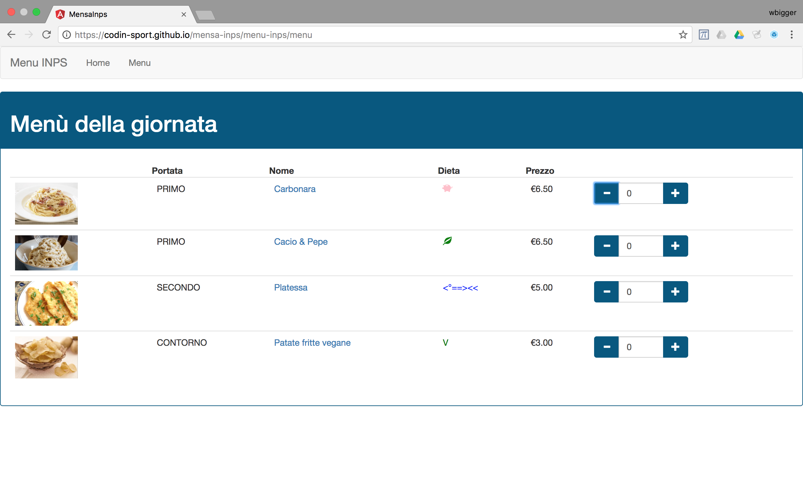
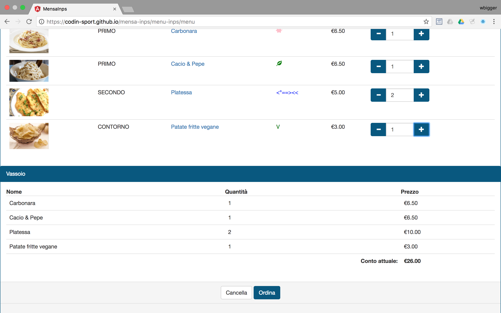
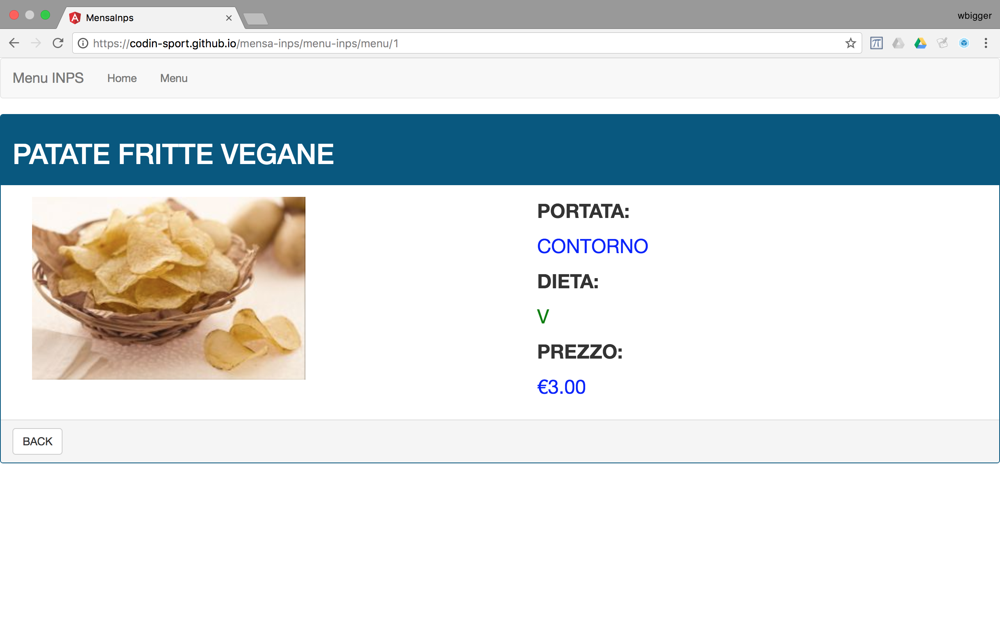

# Welcome to Codin SportCenter!

This is an Angular application developed during a 4-days training course, provided by Adecco for Codin.

During the course we designed the app using Agile Methodology, in particular a light version of Scrum.

You can see a live version of this app on GitHub Pages: https://codin-sport.github.io/mensa-inps/

# User Stories [ITA]
1. Come utente, voglio vedere il menu in anticipo per sapere cosa ci sarà da mangiare oggi.
2. Come utente, voglio poter ordinare i piatti perché altrimenti non trovo niente.

## Screenshots

